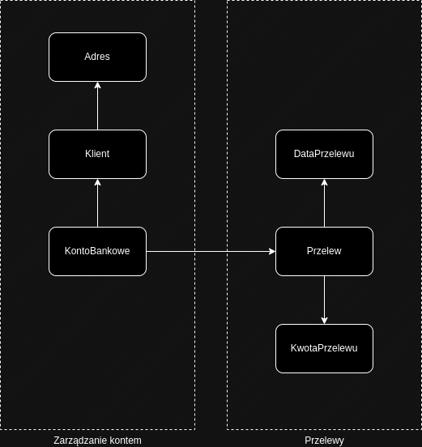

# Domain Driven Design

Poniżej zdefiniowany został bardzo prosty model systemu bankowego. Wydzielone zostały dwa Bounded Contexts: `Zarządzanie kontem` oraz `Przelewy`. Integracja między tymi kontekstami zachodzi między encjami `KontoBankowe` oraz `Przelew`. W każdej encji oraz Value Object zdefiniowane zostały minimalne wymagane pola.

## Bounded Contexts

1. Zarządzanie kontem
2. Przelewy

W tym prostym modelu Bounded Contexts są tożsame z Aggregate Boundary.

## Agregaty

1. KontoBankowe
2. Przelew

## Encje

### KontoBankowe

- Numer konta (string)
- Klient

### Klient

- ID (string)
- Adres
- Imię (string)
- Nazwisko (string)
- PESEL (string)

### Przelew

- ID (string)
- KwotaPrzelewu
- DataPrzelewu

## Obiekty Wartości

### KwotaPrzelewu

- Wartość (float)
- Waluta

### Adres

- Ulica (string)
- Kod pocztowy (string)
- Miasto (string)

### DataPrzelewu

- Data (date)

## Model

